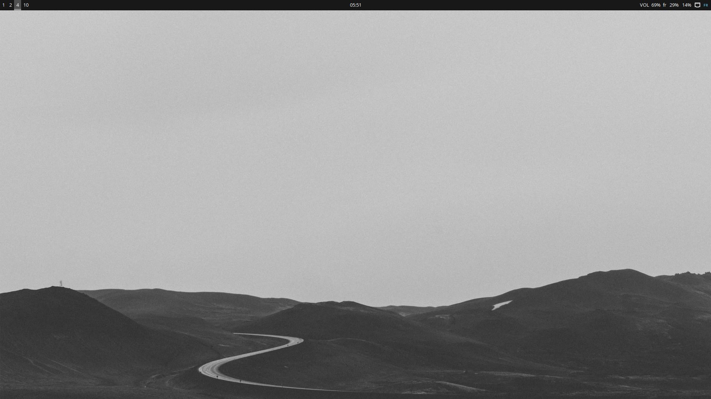
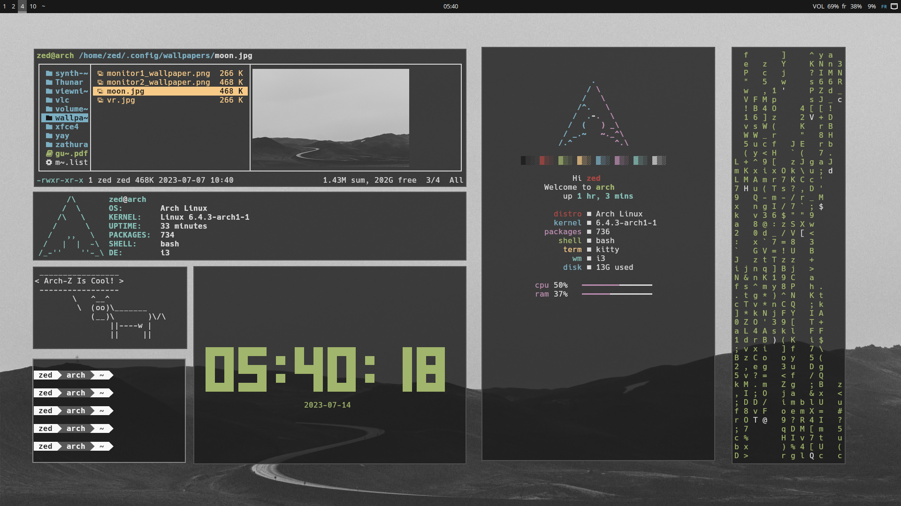
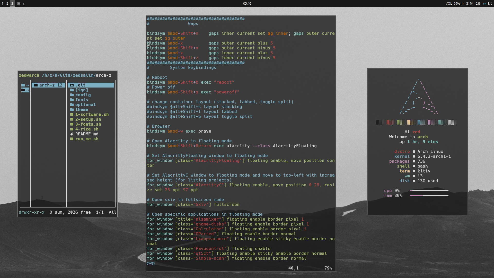
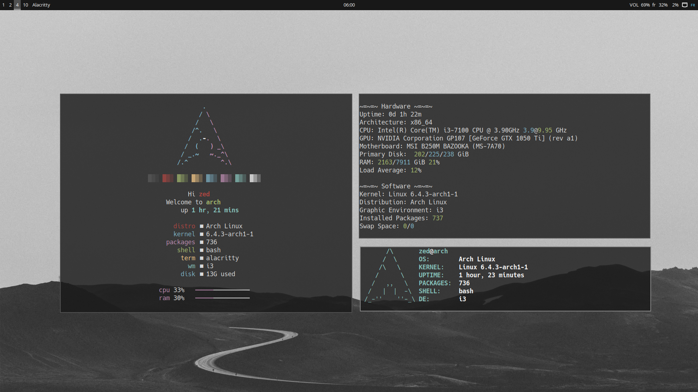

<br />
<div align="center">
  <a href="https://github.com/zedsalim/debian-z">
    
  </a>

  <h3 align="center">Debian Minimal Setup with i3</h3>

  <p align="center">
    Automate and Style Your Debian Setup with Debian-Z!
    <br />
</div>

## About The Project

- **WM:** [i3-gaps](https://github.com/Airblader/i3)
- **OS:** [Arch Linux](https://archlinux.org)
- **Terminal:** [kitty](https://github.com/kovidgoyal/kitty)
- **Shell:** [bash](https://wiki.archlinux.org/title/Bash)
- **Status Bar:** [polybar](https://github.com/polybar/polybar)
- **Compositor:** [picom](https://github.com/ibhagwan/picom)
- **Editor:** [neovim](https://github.com/neovim/neovim)
- **Browser:** [Brave](https://github.com/brave/brave-browser)
- **File Manager:** [pcmanfm](https://github.com/lxde/pcmanfm)
- **Application Launcher:** [rofi](https://github.com/davatorium/rofi)


This project is a shell script that automates the post installation process for a minimal Arch system, along with the i3 window manager. It aims to provide an easy and efficient way to configure and arch desktop environment with a Stylish lightweight and customizable window manager.

The script installs the necessary packages and applications required for daily drive and a functional and beutiful i3wm setup, and other recommended utilities. It also configures various system settings to optimize the user experience and provides a clean minimal and stylish i3 configuration. 

## Previews






---

## Pre-Installation

To use this script and set up your Arch system with my i3 config, follow these steps:

1. Install a fresh minimal Arch system. You can download the ISO from the official [Arch website](https://archlinux.org/).

2. Once the base system is installed:
### Install git and vim (or your favorite text editor)
```bash
sudo pacman -S git vim
```
### Clone this repo
```bash
git clone https://github.com/zedsalim/arch-z
cd arch-z
ls
.git   config  optional  1-software.sh  3-fonts.sh  README.md
[ign]  fonts   theme     2-setup.sh     4-rice.sh   run_me.sh
```
### Categorization of the directories and the scripts
1. Scripts:   
1-software.sh: A script responsible for install all the softwares and the packages needed for a minimal Arch system, **(you must see what inside it and you can custumize it as you need)**.   
2-setup.sh: A script that handles the initial setup of the i3wm environment and the Display Manager.   
3-fonts.sh: A script for font configuration and installation.   
4-rice.sh: A script that performs further customization or "ricing" of Arch-Z i3wm environment.   
run_me.sh: A script meant to be executed to apply the configurations and setups provided by other scripts **(this is the only script you need to run)**   


2. Directories **(Do not modify)**:   
config: The configuration file for the Arch-Z setup.   
fonts: A directory containing font files used in the Debian-Z configuration.   
theme: A directory with theme-related files.   
optional: A folder containing optional configuration files and scripts that are not necessary for the basic setup (check them out).   

3. Other Files **(Delete them if you want)**:   
README.md: A Markdown file serving as the main documentation or guide for this project.   
[ign]: A folder that contains Essential Files for the README.md.   

**_Please note that the directories are marked as "Do not modify" to indicate that they contain important files and resources that should not be altered unless you have specific knowledge or intention to modify them._**

## Installation
**To install this setup, simply run ./run_me.sh, enter your password, and wait for the installation to complete.**
```bash
./run_me.sh
```

## Post-Installation
> Press Super + Shift + h to view the Guide and read it all.
> NOTE: The 'Super' Key is the 'Windows' Key

## Usage
> The Super key is the Windows key
<h2>Keybindings:</h2>
  <pre>
    <h3>Window Manager Keybindings:</h3>
    <table>
      <tr>
        <th>Keybinding</th>
        <th>Action</th>
      </tr>
      <tr>
        <td>super + shift + h</td>
        <td>Opens this Guide</td>
      </tr>
      <tr>
        <td>super + Escape</td>
        <td>Reloads sxhkd config</td>
      </tr>
      <tr>
        <td>super + q</td>
        <td>Closes the current window</td>
      </tr>
      <tr>
        <td>super + shift + c</td>
        <td>Reloads the i3 window manager configuration</td>
      </tr>
      <tr>
        <td>super + shift + r</td>
        <td>Restarts the i3 window manager</td>
      </tr>
      <tr>
        <td>super + shift + q</td>
        <td>Exits i3 window manager</td>
      </tr>
    </table>
    <h3>Application Keybindings:</h3>
    <table>
      <tr>
        <th>Keybinding</th>
        <th>Action</th>
      </tr>
      <tr>
        <td>super + Return (Enter)</td>
        <td>Launches alacritty terminal</td>
      </tr>
      <tr>
        <td>super + shift + Return (Enter)</td>
        <td>Launches alacritty terminal in floating mode</td>
      </tr>
      <tr>
        <td>super + p</td>
        <td>Opens rofi application</td>
      </tr>
      <tr>
        <td>alt + w</td>
        <td>Opens rofi (show mode)</td>
      </tr>
      <tr>
        <td>super + n</td>
        <td>Opens pcmanfm file manager</td>
      </tr>
      <tr>
        <td>super + r</td>
        <td>Opens ranger file manager</td>
      </tr>
      <tr>
        <td>super + g</td>
        <td>Opens Github Desktop (not installed by default)</td>
      </tr>
      <tr>
        <td>super + w</td>
        <td>Launches Brave Browser</td>
      </tr>
      <tr>
        <td>super + c</td>
        <td>Launches VSCodium</td>
      </tr>
      <tr>
        <td>super + d</td>
        <td>Launches Discord (not installed by default)</td>
      </tr>
      <tr>
        <td>super + t</td>
        <td>Launches Telegram Desktop</td>
      </tr>
      <tr>
        <td>Print (Impr écran Syst)</td>
        <td>Opens flameshot screenshot tool (GUI mode)</td>
      </tr>
    </table>
    <h3>Audio Keybindings:</h3>
    <table>
      <tr>
        <th>Keybinding</th>
        <th>Action</th>
      </tr>
      <tr>
        <td>XF86AudioMute</td>
        <td>Toggles audio mute</td>
      </tr>
      <tr>
        <td>XF86AudioLowerVolume</td>
        <td>Decreases audio volume by 2%</td>
      </tr>
      <tr>
        <td>XF86AudioRaiseVolume</td>
        <td>Increases audio volume by 2%</td>
      </tr>
    </table>
    <h3>Brightness Keybindings:</h3>
    <table>
      <tr>
        <th>Keybinding</th>
        <th>Action</th>
      </tr>
      <tr>
        <td>XF86MonBrightnessDown</td>
        <td>Decreases audio volume by 10%</td>
      </tr>
      <tr>
        <td>XF86MonBrightnessUp</td>
        <td>Increases audio volume by 10%</td>
      </tr>
    </table> 
    <h3>i3 Window Manager Keybindings:</h3>
    <table>
      <tr>
        <th>Keybinding</th>
        <th>Action</th>
      </tr>
      <tr>
        <td>super + v</td>
        <td>Splits the current container vertically</td>
      </tr>
      <tr>
        <td>super + h</td>
        <td>Splits the current container horizontally</td>
      </tr>
      <tr>
        <td>super + f</td>
        <td>Toggles fullscreen mode for the current container</td>
      </tr>
      <tr>
        <td>super + shift + f</td>
        <td>Toggles floating mode for the current container</td>
      </tr>
      <tr>
        <td>super + control + space</td>
        <td>Toggles focus between tiling and floating mode</td>
      </tr>
      <tr>
        <td>super + alt + a</td>
        <td>Focuses on the parent container</td>
      </tr>
      <tr>
        <td>alt + shift + s</td>
        <td>Change container layout to stacked</td>
      </tr>
      <tr>
        <td>alt + shift + t</td>
        <td>Change container layout to tabbed</td>
      </tr>
      <tr>
        <td>alt + shift + e</td>
        <td>Change container layout to toggle split</td>
      </tr>
    </table>
    <h3>Workspace Keybindings:</h3>
    <table>
      <tr>
        <th>Keybinding</th>
        <th>Action</th>
      </tr>
      <tr>
        <td>super + [1->9,0]</td>
        <td>Switches to the specified workspace</td>
      </tr>
      <tr>
        <td>super + shift + [1->9,0]</td>
        <td>Moves the current container to the specified workspace</td>
      </tr>
    </table>
    <h3>Window Movement Keybindings:</h3>
    <table>
      <tr>
        <th>Keybinding</th>
        <th>Action</th>
      </tr>
      <tr>
        <td>super + [h, j, k, l]</td>
        <td>Focuses on the window in the specified direction</td>
      </tr>
      <tr>
        <td>super + shift + [h, j, k, l]</td>
        <td>Moves the window in the specified direction</td>
      </tr>
      <tr>
        <td>super + [Left, Down, Up, Right]</td>
        <td>Focuses on the window in the specified direction</td>
      </tr>
      <tr>
        <td>super + shift + [Left, Down, Up, Right]</td>
        <td>Moves the window in the specified direction</td>
      </tr>
      <tr>
        <td>super + tab</td>
        <td>Focuses on the last two workspaces back and forth</td>
      </tr>
    </table>
    <h3>Additional Keybindings:</h3>
    <table>
      <tr>
        <th>Keybinding</th>
        <th>Action</th>
      </tr>
      <tr>
        <td>alt + x (Where I keep all the courses and videos I need to learn from)</td>
        <td>Opens ranger in ~/Downloads/Watch (not created by default)</td>
      </tr>
      <tr>
        <td>alt + c</td>
        <td>Opens the confige files that i edit frequently</td>
      </tr>
      <tr>
        <td>alt + t</td>
        <td>Change the theme on the fly</td>
      </tr>
      <tr>
        <td>alt + b</td>
        <td>Opens my bookmarks (add yours inside ~/config/bookmarks.txt)</td>
      </tr>
      <tr>
        <td>alt + y (you must copy first the URL of a youtube video)</td>
        <td>Script that plays youtube videos using the mpv</td>
      </tr>
      <tr>
        <td>alt + s (Create your own schedule in ~/Pictures/schedule.png)</td>
        <td>Opens my Work/Studies Schedule</td>
      </tr>
      <tr>
        <td>F1 (Add your wallpapers in ~/.config/wallpapers/)</td>
        <td>Changing the wallpaper for the main monitor</td>
      </tr>
      <tr>
        <td>F2</td>
        <td>Changing the wallpaper for two monitors</td>
      </tr>
    </table> 
    <h3>Gaps Keybindings:</h3>
    <table>
      <tr>
        <th>Keybinding</th>
        <th>Action</th>
      </tr>
      <tr>
        <td>super + shift + n</td>
        <td>Adjusts inner and outer gaps simultaneously</td>
      </tr>
      <tr>
        <td>super + x</td>
        <td>Increases outer gaps by 5</td>
      </tr>
      <tr>
        <td>super + shift + x</td>
        <td>Decreases outer gaps by 5</td>
      </tr>
      <tr>
        <td>super + z</td>
        <td>Increases inner gaps by 5</td>
      </tr>
      <tr>
        <td>super + shift + z</td>
        <td>Decreases inner gaps by 5</td>
      </tr>
      <tr>
        <td>super + ctrl + [Left, Down, Up, Right]</td>
        <td>Resizes the current window</td>
      </tr>
    </table>
    <h3>System Keybindings:</h3>
    <table>
      <tr>
        <th>Keybinding</th>
        <th>Action</th>
      </tr>
      <tr>
        <td>super + shift + b</td>
        <td>Reboots the system (sudo reboot)</td>
      </tr>
      <tr>
        <td>super + shift + s</td>
        <td>Shuts down the system (sudo shutdown now)</td>
      </tr>
    </table>
</pre>

## Contact

* [Facebook](https://facebook.com/sxaliim) 
* [Telegram](https://t.me/sxalim) 
* salim.zaidi@univ-bouira.dz


